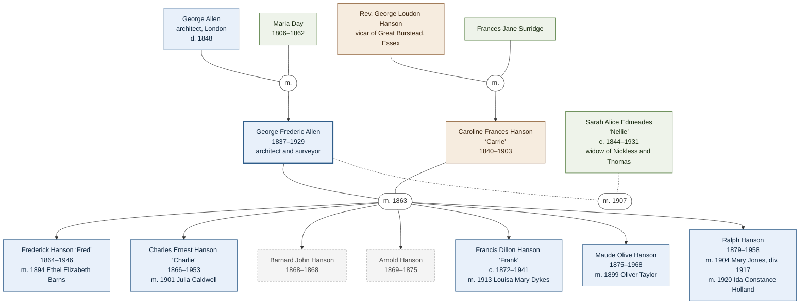

A note on names.  His name is spelt "Frederic" in his marriage and death
registrations and in the Dictionary of New Zealand Biography.  He signed himself
"Geo. Fred. Allen", the newspapers of his day printed "Frederick" or "Fredric"
as often as not, and the family often writes "Frederick" or simply "GF Allen".
In his day, Whanganui was spelt "Wanganui", so older sources use that form.

Every fact in this dossier comes from a published source or an official record,
listed at the end.  Where a detail is uncertain or still to be confirmed, the
text says so.

## His life at a glance

George lived for 92 years, and nearly 69 of them were spent in New Zealand.  The
table below sets out the main events in order.

| Date         | What happened                                                                                                     |
| ------------ | ----------------------------------------------------------------------------------------------------------------- |
| 15 Feb 1837  | Born at 69 Tooley Street, London, the eldest son of the architect George Allen and Maria, née Day.                |
| 28 Jun 1848  | His father dies, leaving Maria with six children aged between one and eleven.                                     |
| Oct 1853     | Moves from the family home in Brighton to London to train as an architect and surveyor in his late father's firm. |
| 5 Apr 1860   | Sails from Gravesend for New Zealand in the *Egmont*.                                                             |
| 18 Jul 1860  | The *Egmont* anchors off Queen Street Wharf, Auckland.                                                            |
| 1860–61      | Works about eighteen months on Great Barrier Island, until the kauri venture fails.                               |
| About 1862   | Teaches at the Church of England Grammar School, then practises with J. O. Barnard.                               |
| Jul 1862     | Moves to Wellington as a district surveyor.                                                                       |
| Nov 1862     | Is sent to Whanganui, where he lives for most of the next forty years.                                            |
| 21 Oct 1863  | Marries Caroline Frances (Carrie) Hanson at St Matthew's Church, Auckland.                                        |
| 7 Oct 1864   | His first child, Fred, is born.                                                                                   |
| Jul 1865     | Finds a message in a bottle from besieged Pipiriki and joins the relief party.                                    |
| 1866         | Christ Church, Whanganui, opens, with furniture he designed.  He joins Lodge Tongariro.                           |
| 1867         | Draws the plans for Trenton House, now called Oneida, at Fordell.  It is built in 1869–70.                        |
| 1871–73      | St Stephen's Church, Marton, is built to his design.  It opens on St Stephen's Day, 26 December 1873.             |
| 1879         | His youngest child, Ralph, is born.                                                                               |
| 1880         | The plans for a new church at Waverley are held at his office.                                                    |
| 1883         | Surveys at Te Korito and visits Kaiwhaiki.                                                                        |
| 11 Oct 1889  | Whanganui citizens present him with a purse of sovereigns.                                                        |
| 1892         | His sons build the family a cottage at Te Pohue, near Mangamahu.                                                  |
| 1894         | Publishes *Willis's Guide Book* and draws his panorama of Ruapehu and Ngāuruhoe.                                  |
| 10 Mar 1895  | Sketches Ruapehu erupting.                                                                                        |
| 10 Jan 1903  | Carrie dies at Oneida.                                                                                            |
| 11 Feb 1907  | Marries Sarah Alice (Nellie) Thomas, née Edmeades, in Dunedin.                                                    |
| Apr–Jul 1924 | Writes "Wanganui in the '60s" and is reunited in Whanganui with his brother Charles.                              |
| 28 Feb 1929  | Dies at Masterton, aged 92.  He is buried in the Archer Street Cemetery on 2 March.                               |

Sources:
[Dictionary of New Zealand Biography];
[Hanson-Allen Family website];
[George's reminiscences];
[New Zealander, 21 July 1860, "Maritime Record"];
[Heritage New Zealand: St Stephen's Church, Marton];
[Masterton District Council cemetery search].

## Beginnings in London

George Frederic Allen was born on 15 February 1837 at 69 Tooley Street, near
London Bridge, the eldest son of the architect George Allen and his wife Maria,
née Day.  (The family website spells her name "Marie".)

His father had been articled to an architect named Sames, taken over the
practice at that address and held several surveying posts in the district.  The
firm, Allen, Snooke & Stock, designed many of the principal warehouses along
the Thames.  Family research also credits George senior with the façades at each
end of London Bridge, which was rebuilt in the 1820s.  He died on 28 June 1848,
leaving Maria with six children aged between one and eleven.

George was the eldest of nine children, three of whom died as babies.  The
family's trees on MyHeritage and Geni give their dates as follows.

| Child               | Born        | Died        |
| ------------------- | ----------- | ----------- |
| George Frederic     | 15 Feb 1837 | 28 Feb 1929 |
| Mary Frances        | 19 Nov 1838 | 20 Feb 1839 |
| Charles William     | 26 Mar 1840 | 1924        |
| Emma Louisa         | 31 Mar 1841 | 1916        |
| Maria               | 17 Jul 1842 | 31 Jul 1842 |
| Julia               | 17 Nov 1843 | 29 Nov 1934 |
| Henry Thomas        | 24 Sep 1844 | 10 Jan 1845 |
| Alfred Henry        | 17 Jan 1846 | 14 Jul 1904 |
| Emily Georgina Drew | 30 Jun 1847 | 1893        |

This fits the family website's statement that six children were living when
their father died in June 1848, the youngest, Emily, being then a few days
short of her first birthday.  Two of George's brothers and sisters appear later
in this story: Charles William and Julia.  Their mother, Maria, was born on 31
May 1806 and died on 16 May 1862, two years after George sailed.

In October 1853, at the age of sixteen, George moved from the family home in
Brighton to London.  There he studied architecture and surveying in his late
father's business, as a pupil of the partner Henry Stock.  By 1856 the family
was living at Sydenham Cottage in Epsom.

The Allens were friends of the Reverend George Loudon Hanson, vicar of Great
Burstead in Essex, and his wife Frances Jane, née Surridge.  Their children
spent much time with the Allen children.  George was close to Tom (Thomas
Surridge) Hanson, who was born at Felsted on 25 February 1839 and died in 1897,
and he had clearly noticed Tom's sister Caroline Frances, known as Carrie, who
was the Hansons' eldest daughter.  She was born at Felsted, Essex, on 31 August
1840.

Sources:
[Hanson-Allen Family website];
[Dictionary of New Zealand Biography];
[Geni: George Frederic Allen];
[the family's MyHeritage site, "Allen Web Site"], "export-Forest" tree;
[New Zealander, 22 October 1863].

## Sailing to Aotearoa on the Egmont

George gave up a secure place in London to take a risk on the other side of the
world.  It had been arranged that he would join his late father's firm as a
junior partner.  Instead, a friend, Captain John Young, who had visited New
Zealand, suggested that the two of them start a sawmill to cut kauri for sale
in Auckland.  While still in England, George accepted the post of engineer to
the Great Barrier Island Kauri Timber & Copper Mining Company.

He was twenty-three when the *Egmont*, an 800-ton ship commanded by Captain
Gibson, left Gravesend on 5 April 1860, the day before Good Friday.  The voyage
was not uneventful.  On 12 July, off Dusky Bay, a southerly gale carried away
the tiller and broke the rudder head, but the ship made her way up the west
coast and sighted the Three Kings Islands a few days later.  She was off Great
Barrier Island on the evening of Tuesday 17 July, and at 2 p.m. on Wednesday 18
July 1860 she anchored off Queen Street Wharf in Auckland, 104 days after
leaving Gravesend.  She brought about a hundred passengers.  The list of cabin
passengers printed in the *Daily Southern Cross* includes "John B. Young" and
"G. F. Allen", so George and his partner made the voyage together.

This settles a question that the first edition of this dossier left open.  The
Dictionary of New Zealand Biography gives 19 July, which is the date on which
the ship was formally entered at Customs.  The date of 7 August 1860 in George's
undated reminiscences is a slip, whether of memory or of transcription.  In his
1924 newspaper article, George himself wrote only that he arrived in July,
after 104 days.

His Newfoundland dog, Flora, seems to have made the voyage with him.  George had
trained a dog of that name in London in 1856.  That dog was with him on Great
Barrier Island, and he still had a dog called Flora when he reached Whanganui in
1863.

Sources:
[New Zealander, 21 July 1860, "Maritime Record"];
[Daily Southern Cross, 20 July 1860, "Shipping Intelligence"];
[Auckland Examiner, 21 July 1860];
[G. F. Allen, "Wanganui in the '60s"];
[Hanson-Allen Family website];
[George's reminiscences];
[Dictionary of New Zealand Biography];
[Great Barrier Island painting and caption].

## Aotea Great Barrier Island: the kauri venture that failed

George and Captain Young spent about eighteen months on Great Barrier Island
(Aotea), and the venture ended in financial loss.  The company had bought
sawmilling equipment and employed both Māori and European workers.  It also
built a dam on a stream that was said at the time to be the largest in New
Zealand.

The plan was to fell kauri, roll the logs into the stream bed and let the
dammed water carry them down to the sea.  In the eighteen months George was
there, there was too little rain to fill the dam, but the men kept felling
trees anyway.  Then heavy rain came.  The dam overflowed and collapsed, and the
logs rushed out to sea, breaking the boom that was meant to catch them.  Very
few were saved.

With most of the company's capital gone, the men were paid off and George
returned to Auckland.  In his own summing-up, he had spent £145 on the work and
came back owing £20, with £5 in the bank.

There were happier memories.  For the first three months George and Captain
Young boarded at the cottage of an old Swedish sailor, Robinson, at the head of
Kaiarara Bay, Port Fitzroy.  Mrs Robinson was an excellent cook and housekeeper,
and she later did their washing and bread-baking once their own cottages were
built.

George also explored.  He climbed Hirakimata, the island's highest peak, which
the Admiralty chart called Mount Hobson.  The climb was slow because of fallen
trees, so he reached the top at sunset and slept there beside a fire, with his
dog Flora for company.  In the morning, with a telescope, he could make out the
windmill at Auckland, St Paul's Church and Mount Eden.  A nearby peak, Allen's
Peak, and the double-peaked Mount Young, named for his partner, appear in a
small painting that he captioned and signed in September 1862.

Sources:
[Hanson-Allen Family website];
[Great Barrier Island painting and caption];
[George's reminiscences];
[Dictionary of New Zealand Biography].

## Auckland and Wellington: architect, then government surveyor

Back in Auckland, George found work as an assistant master at the Church of
England Grammar School for a few months.  Then a chance came to return to his
own profession, and he went into partnership as an architect and surveyor with
James Orme Barnard.

The partners entered a competition for the design of the first St Matthew's
Church in Auckland, in which they beat five other architects and won a prize of
£20.  George later noted with pride that the church was built of kauri and was
still sound.  By 1929 it was being used as a Sunday school.  In their first six
months together, working sixteen-hour days, the two men earned £350.

In the winter of 1862 William Fox, who was then Premier, offered both men posts
as district surveyors in the Province of Wellington.  A district surveyor
measured and mapped land so that its boundaries could be recorded.  Each post
paid a certain salary of £300 a year, and although they were reluctant to leave
Auckland, the pair accepted.  In his 1924 article George wrote that the
appointment was made by the Superintendent of the province, Dr Isaac
Featherston, and that he sailed for Wellington in the steamer *Lord Worsley* in
July 1862.  In Wellington he did one survey and a good deal of mapping, and he
joined the Pacific Lodge of Freemasons.

In November 1862 the partners went separate ways.  Barnard was sent to the
Wairarapa, and George was "lent" to Whanganui "for the summer months".  He
stayed for most of the rest of his working life.

Sources:
[George's reminiscences];
[G. F. Allen, "Wanganui in the '60s"];
[Hanson-Allen Family website];
[Dictionary of New Zealand Biography];
[Wanganui Herald, 1 March 1929].

## Settling in Whanganui, 1862–1870

George reached Whanganui in November 1862 in the *Stormbird*, an iron screw
steamer of the Wellington Steam Navigation Company.  She had been built as a
yacht for the King of Sweden and was then a pretty vessel rigged as a topsail
schooner.  As was the custom, she fired her six-pounders as she came up the
river past Pūtiki.  The arrival of a mail steamer was the great event of the
month, so the whole town turned out at the wharf.

He reported to the senior district surveyor, David Porter, and worked with him
for three years and three months without a cross word between them.  Porter was
also captain of the Victoria Company of Volunteer Riflemen, and George joined
the company as a private a few days after he arrived.  When the volunteer
companies were later merged into the Militia, he served in it too, for about
four years in all.

His first lodging was the Commercial Hotel, kept by George Howe, where a week
cost thirty shillings for himself and his Newfoundland dog.  He then took a
sitting room and two tiny bedrooms with Mr and Mrs William Pick, at the corner
of Wilson and Ridgway Streets, and stayed there for over a year, until after
his marriage.  In his 1924 article George remembered that Mrs Pick would not let
the cat into his sitting room, and that one day the cat escaped up the chimney.

In 1863 his fiancée, Carrie, sailed to join him (see the whānau section below).
The family website says that George asked his employers for three months' leave
for a honeymoon and that, when they allowed only one month, he resigned and
took up private surveying.  That does not sit easily with George's own statement
that he worked with Porter for three years and three months, which would take
him to about early 1866, and the Dictionary of New Zealand Biography follows
George's timing.  Either way, he later set up in private practice, surveyed
properties at Papaiti and drew up plans for a new vicarage.  When the fighting
in the district brought surveying to a stop, he opened a private school.

### The message in the bottle, 1865

On 19 July 1865 about 300 militiamen under Major Brassey were besieged in their
redoubts at Pipiriki, up the Whanganui River, by Pai Mārire fighters, and they
ran short of ammunition and food.  Brassey sent messages downriver in bottles.
According to the family, he wrote in Latin because some of the besiegers could
read English; the Australian War Memorial's account says there were two
bottles, one in French and one in Latin.  George found one of the bottles and
carried the message to the Militia office.  He also took part in the party led
by Major C. C. Rookes that was sent up the river to relieve Pipiriki.  The siege
was over within about twelve days.

Military matters dominated Whanganui for years afterwards.  One visitor to the
Allens' home in St Hill Street was Major von Tempsky, shortly before his death
in battle in 1868.

Sources:
[G. F. Allen, "Wanganui in the '60s"];
[George's reminiscences];
[Hanson-Allen Family website];
[Dictionary of New Zealand Biography];
[Australian War Memorial: The river and the redoubts].

## The whānau: Carrie and the seven children

Caroline Frances Hanson, known as Carrie, was George's wife and the heart of
the family.  She was born at Felsted, Essex, on 31 August 1840, the eldest
daughter of the Reverend George Loudon Hanson and Frances Jane, née Surridge.
After George settled in Whanganui, Carrie sailed to New Zealand in the *Ganges*
and reached Auckland on 12 October 1863.  She and George were married nine days
later, on 21 October 1863, by the Reverend David Jones in the new St Matthew's
Church, the church George had helped to design.  The marriage notice describes
the bridegroom as "of the Wellington Provincial Survey Department, Whanganui".

The couple made their home in St Hill Street, Whanganui, and Carrie joined the
town's musical life.  At the first concert of the new Wanganui Choral Society in
January 1864, she sang the second verse of the hymn "Brightest and Best", and
George sang the third.

Life was not easy for her.  George often spent long periods surveying in the
backblocks, and he was known to spend days in bed with bad headaches.  The
family remembers him as talented and cheerful but sometimes impractical, so
much of the household burden fell to Carrie.  When an attack on Whanganui seemed
likely during the wars, she gathered her small children and took shelter with
the townspeople in the Rutland Stockade.

In 1892 her two eldest sons built her and George a small cottage of ponga logs
and daub on land that had been won in a ballot at Te Pohue, in the Mangamahu
Valley.  The nearest road was seven miles away along a bridle track.  George's
obituary says that the family settled at Mangamahu about 1890.

### Their children

Each child was given the middle name Hanson, after Carrie's family.  Five of the
seven children grew up.  This matches the Dictionary of New Zealand Biography,
which mentions four sons and a daughter, and George's obituary, which lists
four sons and a daughter as surviving him in 1929, together with 19
grandchildren and several great-grandchildren.

The tree reads from the grandparents at the top, to George and his two wives in
the middle, to his children with Carrie in birth order along the bottom.  The
rounded boxes mark marriages, the dotted lines mark George's second marriage,
and the grey dashed boxes mark the two boys who died young.  Blue boxes are
Allens, brown boxes are Hansons and green boxes are people who married into the
family.  The diagram is written in Mermaid, so it displays as a picture in
GitHub, Obsidian and most other Markdown viewers.

<table>
  <tbody>
    <tr>
      <th> Child        </th>
      <th> Born         </th>
      <th> Died         </th>
      <th> What we know </th>
    </tr>
    <tr>
      <td> Frederick Hanson ("Fred") </td>
      <td> 7 Oct 1864, Whanganui </td>
      <td> 21 Sep 1946, Raetihi </td>
      <td>
        He was a farmer, a surveyor and a local-body politician, and he sat on
        the Wanganui East Borough Council (at first called Eastbrook) by 1908.
        He married Ethel Elizabeth Barns (born at Whanganui on 9 October 1871,
        died at Christchurch in 1948) on 26 April 1894, and they had six
        children.  In 1924 he hosted his father and uncle in Whanganui.
      </td>
    </tr>
    <tr>
      <td> Charles Ernest Hanson ("Charlie") </td>
      <td> 25 Jun 1866                       </td>
      <td> 18 Jan 1953, Whanganui            </td>
      <td>
        He was a farmer and surveyor, and his birth was not registered until
        1921.  He lived at Pukeroa in 1904, and by 1913 he was a land agent at
        Frankton Junction, where he chaired the Frankton Town Board.  He was
        Mayor of Frankton by 1915 (the family website says twice) and resigned
        in May 1916 when he left the district.  He was living at Tauranga in
        1929.  He wrote an unpublished memoir, *Eighty Years in New Zealand*.
        He married Julia Caldwell on 6 June 1901, and they had no children.  He
        is buried at Aramoho Cemetery.
      </td>
    </tr>
    <tr>
      <td> Barnard John Hanson    </td>
      <td> Late Sep 1868          </td>
      <td> 10 Nov 1868, Whanganui </td>
      <td>
        He died as a baby, aged six weeks.  No birth registration has been found.
      </td>
    </tr>
    <tr>
      <td> Arnold Hanson          </td>
      <td> 30 Nov 1869            </td>
      <td> 10 Mar 1875, Whanganui </td>
      <td>
        He died of acute laryngitis at the age of five.  Fred and Maude later
        gave the name Arnold to their sons, presumably in his memory.
      </td>
    </tr>
    <tr>
      <td> Francis Dillon Hanson ("Frank") </td>
      <td> About 1872–73                   </td>
      <td> 19 Apr 1941, aged 68            </td>
      <td>
        He went up Ruapehu with his father in the 1890s, was the up-river mail
        contractor at Mangamahu in 1897, and later farmed at Kōriniti on the
        Whanganui River.  He married Louisa Mary Dykes on 19 March 1913 at
        Pūtiki Mission.  They had a daughter, Annie, who was born in 1915 and
        lived only a day.  He is buried at Aramoho Cemetery.  No birth
        registration has been found.
      </td>
    </tr>
    <tr>
      <td> Maude Olive Hanson     </td>
      <td> 29 Jun 1875, Whanganui </td>
      <td> 4 Nov 1968, Auckland   </td>
      <td>
        She was the only daughter.  She married Oliver Taylor on 5 April 1899 at
        Te Pohue, and they had ten children.  The first and last died at birth,
        and eight grew up.  She was living at Ōtāhuhu in 1929.
      </td>
    </tr>
    <tr>
      <td> Ralph Hanson                 </td>
      <td> 11 Sep 1879, Whanganui       </td>
      <td> 8 May 1958, Palmerston North </td>
      <td>
        He was a surveyor and farmer, and for many years a government Rural Land
        Valuer at Palmerston North.  He married Mary Jones on 1 January 1904 at
        Fred's home at Mangamahu, and they were divorced on 10 May 1917.  He
        married Ida Constance Holland on 29 September 1920, and they had four
        children.
      </td>
    </tr>
  </tbody>
</table>

The dates of birth, marriage and death in the table have been checked against
the official indexes and the Aramoho Cemetery register wherever an entry exists.
The other details come from the family website and from newspapers.  The family
website gives Charlie's birth year as 1886 and his death as 18 July 1953, and it
gives Frank's death as 1942; the official records show that these were misprints
for 1866, 18 January 1953 and 1941.

A photograph taken in August 1889 shows the whole family together.  Fred,
Charlie and Frank stand at the back, although the family is not sure which of
the first two is which.  George, Carrie, Maude and Ralph are seated in front.

### Cousins across the sea

George's sister Julia married Carrie's brother William Hanson, a homeopathic
doctor.  They settled in Fort Myers, Florida, where Julia became a leader of the
women's clubs.  She died there on 29 November 1934, aged 91, and is buried in
the Fort Myers Cemetery.  Some of their descendants still live in Fort Myers.

George's brother, Captain Charles William Allen, left England for Canada in
1859, a year before George sailed.  The family website says that he became a
journalist and newspaper editor, and the newspapers of 1924 call him a Canadian
army veteran.  In July 1924, at the age of 84, he came to New Zealand to see
George, whom he had not seen for sixty-five years.  The brothers met on the
Wellington wharf, and the recognition was instant.  In Whanganui they stayed
with Fred and were the guests of honour at a lively evening at which George,
then 87, sang and led the choruses.  Charles died later that year at Regina,
Canada, on his way home to Winnipeg.  The family tree on MyHeritage records his
burial at Philadelphia, which may explain why one Whanganui newspaper described
him as living in Philadelphia.

Sources:
[The children of George and Carrie];
[Hanson-Allen Family website];
[Dictionary of New Zealand Biography];
[Births, Deaths & Marriages Historical Records];
[Whanganui District Council cemetery search];
[Daily Southern Cross, 13 October 1863];
[New Zealander, 22 October 1863];
[Wanganui Chronicle, 14 December 1907];
[Wanganui Chronicle, 17 June 1908];
[Waikato Argus, 3 April 1913];
[Waikato Times, 19 April 1915];
[New Zealand Herald, 19 May 1916];
[Wanganui Chronicle, 29 April 1897];
[Wanganui Chronicle, 30 July 1924];
[Manawatu Standard, 4 December 1924];
[Wanganui Herald, 1 March 1929].

## Faith, music and community

George was a devout Anglican who led his family in prayers every morning and
evening.  He became a churchwarden of Christ Church in Whanganui and designed
the furniture for the new church, which opened in 1866.  He also drew up plans
for a new vicarage.

Music was the other great love of his life.  He played the organ and the flute,
sang solos, and formed the church choir.  When the Wanganui Choral Society held
its first practice in June 1863, 86 people came, and George took charge of the
more experienced singers.  He went on to serve on the society's founding
committee and as its conductor and a soloist.  His obituary adds that he was at
various times choirmaster of Christ Church and of St Mary's Church, and for
many years conductor of the old Philharmonic Society.

He was also a joiner of clubs and a helper of the town.  He was a Freemason,
first in the Pacific Lodge in Wellington and from 1866 in Lodge Tongariro in
Whanganui, where he was at one time secretary.  In Lodge St Andrew Kilwinning he
was chaplain, choirmaster and secretary, and at his death he was its last
surviving foundation member.  He designed the old Freemasons' Hall in St Hill
Street.  He was also the secretary of the Wanganui Volunteer Fire Brigade.

Sources:
[Dictionary of New Zealand Biography];
[Hanson-Allen Family website];
[George's reminiscences];
[Wanganui Herald, 1 March 1929].

## Buildings and surveys

George's best-known surviving work is Oneida, a tall, steep-roofed timber house
in the "carpenter Gothic" style at Fordell, north-east of Whanganui.  He drew
the plans in 1867, and the house was built in 1869–70 for Joseph and Mary Ann
Burnett.  It was first called Trenton House, and it was later the home of
Cornelius (Con) Burnett.  Heritage New Zealand lists it as a Category 1 historic
place (List number 160).  Its central hall rises 13.5 metres from the ground
floor to the apex of the roof.

Te Ara, the online encyclopedia of New Zealand, counts Oneida among the
country's best Gothic Revival houses, alongside Highwic in Auckland.  The family
website suggests that Highwic influenced George's design, since he was working
in Auckland around the time Highwic was built, in 1862.  The likelier
explanation for the resemblance is a shared American source.  Te Ara says that
Highwic's design was taken from one of Andrew Jackson Downing's American
pattern books, and Heritage New Zealand notes that the Burnetts had lived near
Utica, in Oneida County, New York, and credits their American experience for
the style of the house.

His second surviving landmark is St Stephen's Anglican Church in Marton, which
the Reverend Towgood commissioned from him after the wars ended.  The foundation
stone was laid in 1871, and the church was opened and consecrated on St
Stephen's Day 1873.  It stands on the site of a redoubt from the 1860s wars, has
changed little since it was built, and is listed by Heritage New Zealand as a
Category 2 historic place (List number 1250).  It shares the tall, striking look
of Oneida.

A church of the same name at Waverley, built in 1880, was almost certainly his
work as well.  In March 1880 the tender notice for the "New Church at Waverley"
told builders that the plans and specifications could be seen "at the office of
Mr G. F. Allen, Architect, Wanganui".

Probably few of his other Whanganui buildings still stand.  The old Freemasons'
Hall in St Hill Street had already been replaced by 1929.  He could also be
generous to a fault.  The family remembers that he once designed a building for
a friend without charging for it, at a time when his own household had little
money.

### Surveys of the land

Once peace returned in 1869, George surveyed large blocks of land in the
Waitotara valley and along the Whanganui River.  The work took him into the
upper river country, where he climbed Ruapehu, Ngāuruhoe and Tongariro.  In 1883
he surveyed land at Te Korito for the settler Charles Smith, on the river
opposite Kaiwhaiki (see the section on the land and the river).

His sons followed him into the work.  George took them out of school as soon as
he could to help on the survey parties.  They learned the trade by doing it, but
they had no formal qualifications, so their work had to be signed off by their
father for the Land Transfer Office.

Sources:
[Heritage New Zealand: Oneida Homestead];
[Heritage New Zealand: St Stephen's Church, Marton];
[Te Ara: 19th-century domestic architecture];
[Te Ara: Whanganui places];
[Whanganui Chronicle: St Stephen's 150th anniversary];
[Wanganui Chronicle, 25 March 1880];
[Puke Ariki: St Stephen's Church, Waverley];
[Hanson-Allen Family website];
[Dictionary of New Zealand Biography];
[Wanganui Herald, 1 March 1929].

## The land and the river: the world George entered

The Whanganui River is a tupuna, an ancestor, to Whanganui iwi, who say: *Ko au
te awa, ko te awa ko au* (I am the river and the river is me).  Iwi began
petitioning Parliament to protect the river in the 1870s.  In 2017 the Te Awa
Tupua Act recognised the river as a legal person, and the Crown apologised for
past wrongs.

When George arrived in 1862, Whanganui was a small Pākehā town in a district
that Māori had lived in and cared for over many generations.  The river was the
highway into the interior.  George's own recollections describe settlers
travelling upriver by canoe.  He also recorded the tradition, told to him by the
interpreter John White, that the river was named "Whanganui" (the great
waiting) because an ancestor who came from Taranaki had to wait there for low
water.

### War on the river

The 1860s brought war to the district.  At Moutoa Island in May 1864,
lower-river Whanganui Māori defeated a force of Pai Mārire followers from
upriver.  In January 1865 General Cameron led about 2,000 British troops to the
Waitōtara block, and Cameron himself believed that the real aim of the campaign
was to acquire land.

At Pipiriki in July 1865, Major Brassey's garrison of militia was besieged by
Pai Mārire.  Brassey floated messages downriver in bottles, and George found
one.  A relief force that included Whanganui Māori under Mete Kīngi went
upriver, and the besiegers dispersed; George was a member of the party led by
Major Rookes.  So his bottle story belongs to a conflict that was as much
between Whanganui hapū and iwi as between Māori and Pākehā.  Peace between the
upper and lower river tribes came by the middle of 1866.

### Surveying and the land

A surveyor's maps and boundary lines were part of how land passed into settler
ownership.  After 1869, George surveyed large blocks in the Waitōtara valley and
along the Whanganui River.  This dossier records that work as part of his story.
Whanganui iwi have their own accounts of these years, and it is worth listening
to them.

### Signs of respect and curiosity

George left a few small signs that he paid attention to the people whose land
he worked on.  Local Māori told him that the mountain Ngāuruhoe was really
called Auruahoe, and he kept using that name.  He also spelt the town's name
Whanganui, with an h, long before that spelling was made official, having been
told by John White that such names should always carry the h.

In 1883, surveying land at Te Korito, he crossed to Kaiwhaiki, then a base for
supporters of the Māori King.  A sentry with a fixed bayonet stopped him and his
chainman.  That evening he was allowed, rather reluctantly, to sit in on a
meeting in the whare rūnanga, introduced to the chief Te Oti Takarangi.  The
meeting grew heated, with strong words against the Pākehā authorities, and
George decided it was time to leave.

Sources:
[NZHistory: Fighting on the Whanganui River];
[NZHistory: The 1865 campaign];
[Australian War Memorial: The river and the redoubts];
[Te Ara: Whanganui places];
[National Geographic: Whanganui River is a legal person];
[G. F. Allen, "Wanganui in the '60s"];
[George's reminiscences];
[Hanson-Allen Family website].

## Mountain guide and tourism pioneer

George's survey work took him far up the Whanganui River and into the central
North Island, where he climbed Ruapehu, Ngāuruhoe and Tongariro.  By the 1890s
tourists were beginning to follow the route he knew so well, and George turned
his knowledge into a guide book.

*Willis's Guide Book of New Route for Tourists: Auckland–Wellington, via the
Hot Springs, Taupo, the Volcanoes and the Wanganui River* was published in
Whanganui in 1894 by the printer A. D. Willis, who was then the member of
Parliament for Wanganui, and a supplementary edition followed in 1902.  The
first edition runs to 176 pages, with 22 leaves of plates and folding maps, and
George drew some of the illustrations himself.  Both editions are catalogued on
Trove, the National Library of Australia's catalogue, and the State Library of
New South Wales has put the 1894 edition online.

He was a capable artist as well as a surveyor.  His 1894 panorama of Ruapehu and
Ngāuruhoe later appeared on the cover of *Kairuri: The Measurer of the Land*, a
1988 book marking one hundred years of the New Zealand Institute of Surveyors.
On 10 March 1895 he sketched Ruapehu in eruption from his home on "Mr Allen's
Run" at Te Pohue, seven miles from Mangamahu and some 34 miles from the
mountain, and noted place names and distances in the margins.

He also built a summer camp on the bank of the Waihohonu Stream, halfway
between Waiouru and Taupō and between Ruapehu and Ngāuruhoe.  It gave coach
passengers a place to stop for refreshments, and George also offered overnight
accommodation for those who wished to join his guided tours up the mountains.
Accounts printed in the Whanganui newspapers in April 1894 describe how, the
month before, he climbed Ruapehu twice from the Waihohonu camp, where there was
a slab-built shelter in a natural clearing in the bush.  He went up once with Mr
Willis and his son Frank, and once with an English traveller, Herbert Jones.
The party went on to Tokaanu and, at Waihī, met the young paramount chief of
Ngāti Tūwharetoa, whom the newspaper called "Te Heuheu No. 4" and described as
a very intelligent man of about thirty.  As Horonuku Te Heuheu Tūkino IV had
died in 1888, this was presumably his son Tūreiti Te Heuheu Tūkino V.

It is worth remembering the history of the mountains.  In 1887 Horonuku Te
Heuheu Tūkino IV of Ngāti Tūwharetoa made a tuku, a customary gift, of the three
volcanic peaks, and Tongariro National Park was established in 1894, the same
year as George's guide book.  It was New Zealand's first national park, and in
1993 it became the first place in the world to be inscribed on the World
Heritage List as a cultural landscape, giving it dual natural and cultural World
Heritage status.  For Ngāti Tūwharetoa the maunga carry deep cultural and
spiritual significance.

Sources:
[Dictionary of New Zealand Biography];
[Hanson-Allen Family website];
[Mount Ruapehu erupting, 1895];
[Trove: Willis's Guide Book, 1894];
[Trove: Supplementary edition, 1902];
[Wanganui Herald, 19 April 1894, "A Trip to Taupo"];
[Wanganui Chronicle, 25 April 1894, "Ruapehu"];
[Te Ara: Te Heuheu Tūkino V, Tūreiti];
[Wikipedia: George Allen (architect)];
[DOC: Tongariro National Park history and culture].

## Later years, 1889–1929

On 11 October 1889 the citizens of Whanganui presented George with a purse of
sovereigns to thank him for his public service.  By then he had lived in the
town for more than twenty-five years.

Carrie developed heart trouble late in 1902.  After a busy Christmas family
gathering she fell ill again, and she was taken to Oneida to stay with the
Burnett family, friends of the Allens.  She died there, in George's arms, at
about 1 a.m. on 10 January 1903, aged 62.  Her obituary called her one of the
best and most unselfish mothers who ever lived.  She was buried at the front of
the Matarawa church, near Oneida, in a grave that is now unmarked but can be
located from the church records.  George was taken to Rotorua to recover after
the funeral.

He kept working.  By April 1904 he was inspecting the Upper Turakina Bridge,
paid twelve shillings for each day he worked, and he was building a new cottage
for his son Frank nearby.  He used his son Charlie's home at Pukeroa, about a
mile from the bridge, as his postal address.  At some time after Carrie's death
he also lived at 7 Kent Terrace, Wellington.

On 11 February 1907 George married again, at St Peter's Church, Caversham,
Dunedin.  His new wife was Sarah Alice Thomas, known as Nellie, a London-born
widow of about 63, née Edmeades.  Her first husband, Henry William Nickless, had
been in charge of the Whakaiahuwaka Native School, about three miles above
Parikino on the Whanganui River, and died on 15 July 1892, aged 49.  On 24 March
1897 she married Richard Thomas, who had also died by 1907.  There were no
children of George's second marriage.

The couple lived at 2 Latham Street, Napier, around 1920, and by 1929 they were
living in Opaki Road, Masterton.  His children lived far away, in Whanganui,
Palmerston North, Tauranga and Ōtāhuhu by 1929, so visits were hard, although
the family sent him money from time to time.  On 5 April 1924 the *Wanganui
Chronicle* published his article "Wanganui in the '60s", and that July his
brother Charles came from Canada to see him after sixty-five years apart.

George died at Masterton on 28 February 1929, aged 92, and was buried in the
Archer Street Cemetery on 2 March (Plan II, row 17, plot GA).  The family
website describes the grave as unmarked but locatable.  Nellie died in Masterton
on 4 April 1931, aged 87, and was buried in the next row (Plan II, row 16, plot
SAA).

Sources:
[Dictionary of New Zealand Biography];
[Hanson-Allen Family website];
[Births, Deaths & Marriages Historical Records];
[Wanganui Herald, 1 March 1929];
[Masterton District Council cemetery search].

## Legacy, and places to visit

George left buildings, maps, drawings and a guide book.  He also left a large
family, and several of his descendants followed him into surveying, farming and
local government.  The family website says that a railway suburb and a street in
Frankton, now part of Hamilton, are named after his son Charlie, who was Mayor
of Frankton during the First World War.  That naming has not yet been confirmed
from another source.

These are places connected with the family:

- **Oneida, Fordell.**
	George's house for the Burnett family stands north-east of Whanganui.
	Heritage New Zealand notes that it is private property with no public access.
- **St Stephen's Church, Marton.**
	This is the second of his two best-known surviving buildings, and it is still
	an active parish church, in Maunder Street.
- **Matarawa church cemetery.**
	Carrie is buried here, near Oneida, in a grave that is unmarked but recorded
	in the church's records.
- **Archer Street Cemetery, Masterton.**
	George (Plan II, row 17, plot GA) and Nellie (Plan II, row 16, plot SAA) are
	buried here in neighbouring rows.
- **Aramoho Cemetery, Whanganui.**
	Frank (buried 21 April 1941) and Charlie (died 18 January 1953) are here.  The
	register also lists a Louisa Mary Allen (buried 2 September 1942) and a Julia
	Allen (died 10 January 1957), who are probably their wives.
- **Whanganui Regional Museum.**
	It holds George's original pencilled reminiscences and biographical index
	cards, according to the family website.
- **Alexander Turnbull Library, Wellington.**
  It holds a copy of Charlie's memoir, *Eighty Years in New Zealand*.
- **Aotea Great Barrier Island.**
  The mountain Hirakimata is where George slept beside a fire in 1860–61.
- **Tongariro National Park.**
	George's Waihohonu camp stood on the coach route between Waiouru and Taupō.
	The park's historic Waihohonu Hut was completed in 1904 by the Tourist and
	Health Resorts Department for coach travellers from Waiouru or Tokaanu.  The
	Department of Conservation's history of the hut does not mention George's
	camp, so please treat any link between the two as unconfirmed.

Sources:
[Hanson-Allen Family website];
[The children of George and Carrie];
[Heritage New Zealand: Oneida Homestead];
[Heritage New Zealand: St Stephen's Church, Marton];
[Whanganui District Council cemetery search];
[Masterton District Council cemetery search];
[DOC: Waihohonu Hut].

## Sources and open questions

The family website was compiled by Val Burr, George's great-granddaughter, and
draws on his own reminiscences, diaries and letters.

- [Dictionary of New Zealand Biography: Allen, George Frederic], by Athol Kirk.
- [Hanson-Allen Family website].
- [The children of George and Carrie].
- [George's reminiscences].
- [Great Barrier Island painting and caption].
- [Mount Ruapehu erupting, 1895].
- [G. F. Allen, "Wanganui in the '60s"].
- [Wanganui Herald, 1 March 1929], and the matching
  [obituary in the *Wanganui Chronicle*].
- [Births, Deaths & Marriages Historical Records], Department of Internal
  Affairs.  The registrations consulted were: births 1864/6650 (Fred),
  1921/31122 (Charlie), 1870/18801 (Arnold) and 1879/1076 (Ralph); marriages
  1863/7175, 1894/1618, 1897/4454, 1899/2009, 1901/1596, 1904/3731, 1907/1532,
  1913/1522 and 1920/8815; and deaths 1868/3126 (Barnard), 1875/441 (Arnold),
  1892/4447 (Henry William Nickless), 1903/3137 (Carrie), 1929/1172 (George),
  1931/3517 (Nellie), 1941/19744 (Frank), 1946/30459 (Fred), 1953/32010
  (Charlie), 1958/33644 (Ralph) and 1968/37435 (Maude).
- [Heritage New Zealand: Oneida Homestead], and
  [Heritage New Zealand: St Stephen's Church, Marton].
- [Whanganui District Council cemetery search] and
  [Masterton District Council cemetery search].
- [Te Ara: 19th-century domestic architecture].
- [Wikipedia: George Allen (architect)].

Other newspaper articles from Papers Past are linked in the sections where they
are used.

For the wider context, these pages were read in summary rather than in full,
so please read them before relying on them:
[Te Ara: Whanganui places],
[NZHistory: The 1865 campaign],
[NZHistory: Fighting on the Whanganui River],
[Australian War Memorial: The river and the redoubts],
[Puke Ariki: St Stephen's Church, Waverley],
[DOC: Tongariro National Park history and culture],
[Te Ara: Te Heuheu Tūkino V, Tūreiti] and
[National Geographic: Whanganui River is a legal person].

### Further reading

- Athol Kirk,
  "George Frederick Allen, 1857–1929",
  *Historical Record*
  14, no. 1 (1983), pages 17–19.
  The dates in this title look like a misprint for 1837–1929.
- Elizabeth Allen,
  *A Farm on the Wanganui River*
  (Wanganui, 1980).
- Nola Easdale,
  *Kairuri: The Measurer of the Land*
  (Petone, 1988).
- G. F. Allen,
  *Willis's Guide Book of New Route for Tourists*
  (1894), and its supplementary edition (1902),
  on [Trove: Willis's Guide Book, 1894].
- Chas. E. H. Allen,
  *Eighty Years in New Zealand*
  (unpublished memoir, about 1944),
  Alexander Turnbull Library.

### Points still to be confirmed

- When George left government service, and whether the honeymoon story or his
	own "three years and three months" is right.
- Whether a railway suburb and a street in Frankton are named after Charlie.
- Whether the historic Waihohonu Hut is on or near the site of George's camp.
- Where the births of Barnard, Frank and Maude were registered, if at all.
- Whether William Fox or Isaac Featherston made George's 1862 appointment.
	George's two accounts differ, and both men may have been involved.
- The exact year of George's two climbs of Ruapehu from Waihohonu.  The accounts
	were printed in April 1894, but the days of the week they give fit March
	1893.

[Wikipedia: George Allen (architect)]: https://en.wikipedia.org/wiki/George_Allen_(architect)

[NZHistory: Fighting on the Whanganui River]: https://nzhistory.govt.nz/media/photo/fighting-whanganui-river

[NZHistory: The 1865 campaign]: https://nzhistory.govt.nz/war/wanganui-war/1865-campaign

[Auckland Examiner, 21 July 1860]: https://paperspast.natlib.govt.nz/newspapers/AKEXAM18600721.2.5

[Daily Southern Cross, 20 July 1860, "Shipping Intelligence"]: https://paperspast.natlib.govt.nz/newspapers/DSC18600720.2.19

[Daily Southern Cross, 13 October 1863]: https://paperspast.natlib.govt.nz/newspapers/DSC18631013.2.3.1

[Manawatu Standard, 4 December 1924]: https://paperspast.natlib.govt.nz/newspapers/MS19241204.2.16

[New Zealander, 21 July 1860, "Maritime Record"]: https://paperspast.natlib.govt.nz/newspapers/NZ18600721.2.4

[New Zealander, 22 October 1863]: https://paperspast.natlib.govt.nz/newspapers/NZ18631022.2.18

[New Zealand Herald, 19 May 1916]: https://paperspast.natlib.govt.nz/newspapers/NZH19160519.2.104

[Waikato Argus, 3 April 1913]: https://paperspast.natlib.govt.nz/newspapers/WAIGUS19130403.2.14

[Wanganui Chronicle, 25 March 1880]: https://paperspast.natlib.govt.nz/newspapers/WC18800325.2.13.3

[Wanganui Chronicle, 25 April 1894, "Ruapehu"]: https://paperspast.natlib.govt.nz/newspapers/WC18940425.2.32

[Wanganui Chronicle, 29 April 1897]: https://paperspast.natlib.govt.nz/newspapers/WC18970429.2.25

[Wanganui Chronicle, 14 December 1907]: https://paperspast.natlib.govt.nz/newspapers/WC19071214.2.60

[Wanganui Chronicle, 17 June 1908]: https://paperspast.natlib.govt.nz/newspapers/WC19080617.2.55

[G. F. Allen, "Wanganui in the '60s"]: https://paperspast.natlib.govt.nz/newspapers/WC19240405.2.72

[Wanganui Chronicle, 30 July 1924]: https://paperspast.natlib.govt.nz/newspapers/WC19240730.2.31

[obituary in the *Wanganui Chronicle*]: https://paperspast.natlib.govt.nz/newspapers/WC19290301.2.37

[Wanganui Herald, 19 April 1894, "A Trip to Taupo"]: https://paperspast.natlib.govt.nz/newspapers/WH18940419.2.20

[Wanganui Herald, 1 March 1929]: https://paperspast.natlib.govt.nz/newspapers/WH19290301.2.33

[Waikato Times, 19 April 1915]: https://paperspast.natlib.govt.nz/newspapers/WT19150419.2.23

[Dictionary of New Zealand Biography]: https://teara.govt.nz/en/biographies/2a7/allen-george-frederic

[Dictionary of New Zealand Biography: Allen, George Frederic]: https://teara.govt.nz/en/biographies/2a7/allen-george-frederic/print

[Te Ara: Te Heuheu Tūkino V, Tūreiti]: https://teara.govt.nz/en/biographies/3t13/te-heuheu-tukino-v-tureiti

[Te Ara: 19th-century domestic architecture]: https://teara.govt.nz/en/domestic-architecture/page-1

[Te Ara: Whanganui places]: https://teara.govt.nz/en/whanganui-places/print

[Puke Ariki: St Stephen's Church, Waverley]: https://terangiaoaonunui.pukeariki.com/story-collections/taranaki-churches/st-stephens-church-waverley/

[Trove: Willis's Guide Book, 1894]: https://trove.nla.gov.au/work/260698400

[Trove: Supplementary edition, 1902]: https://trove.nla.gov.au/work/260851397

[Whanganui District Council cemetery search]: https://wdc.whanganui.govt.nz/Cemeteries/Search.aspx

[Australian War Memorial: The river and the redoubts]: https://www.awm.gov.au/wartime/97/river-and-the-redoubt

[Births, Deaths & Marriages Historical Records]: https://www.bdmhistoricalrecords.dia.govt.nz/

[DOC: Tongariro National Park history and culture]: https://www.doc.govt.nz/parks-and-recreation/places-to-go/central-north-island/places/tongariro-national-park/about-tongariro-national-park/history-and-culture/

[DOC: Waihohonu Hut]: https://www.doc.govt.nz/parks-and-recreation/places-to-go/central-north-island/places/tongariro-national-park/heritage-sites/waihohonu-hut/

[Geni: George Frederic Allen]: https://www.geni.com/people/George-Allen/6000000009114908390

[Heritage New Zealand: St Stephen's Church, Marton]: https://www.heritage.org.nz/list-details/1250/St+Stephens+Church

[Heritage New Zealand: Oneida Homestead]: https://www.heritage.org.nz/the-list/details/160

[Masterton District Council cemetery search]: https://www.mstn.govt.nz/property-rates-and-building/cemeteries/search-our-cemeteries

[the family's MyHeritage site, "Allen Web Site"]: https://www.myheritage.com/family-sites/allen/OYYV66TN7T5UQNRJHLQHHSCEJINDOXQ

[National Geographic: Whanganui River is a legal person]: https://www.nationalgeographic.com/culture/article/maori-river-in-new-zealand-is-a-legal-person-article

[Whanganui Chronicle: St Stephen's 150th anniversary]: https://www.nzherald.co.nz/whanganui-chronicle/news/150th-anniversary-celebrations-for-marton-church-st-stephens-delayed-until-2022/NMNQRITZZJ56LAV7WBVNQWLPOA/

[Great Barrier Island painting and caption]: https://www.oocities.org/hanson_allen/docs/gtbarrier.html

[George's reminiscences]: https://www.oocities.org/hanson_allen/docs/kilwingfa.html

[Mount Ruapehu erupting, 1895]: https://www.oocities.org/hanson_allen/docs/mtruapehu.html

[The children of George and Carrie]: https://www.oocities.org/hanson_allen/firstgennz.html

[Hanson-Allen Family website]: https://www.oocities.org/hanson_allen/gfandcfallen.html

---

<a href="https://github.com/Warwick-Allen/essays" class="github-link">View Source on GitHub</a>
